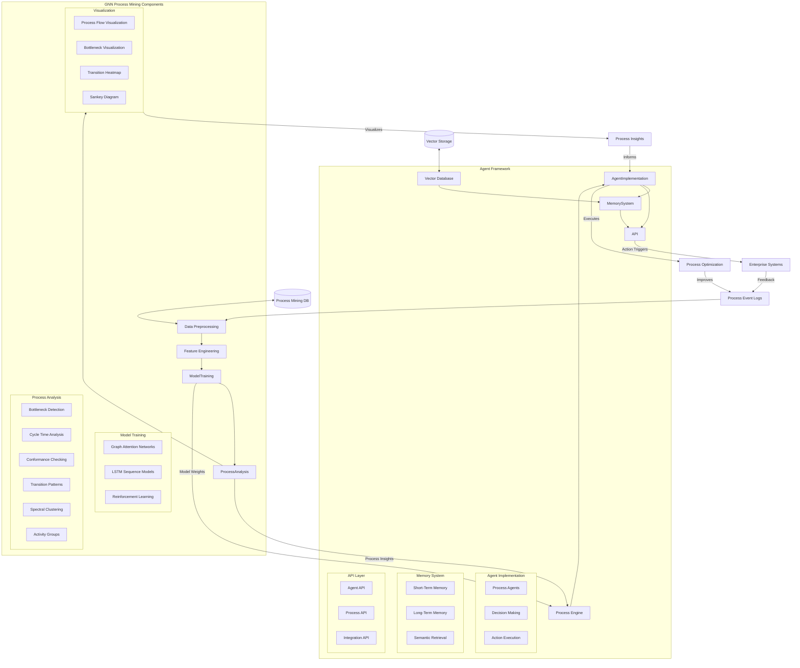
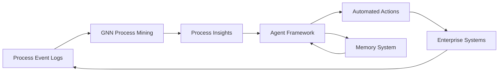

# Advanced Process Mining with GNN and Agent Framework Architecture

This document provides a comprehensive architecture diagram of the AdvancedGNN branch, illustrating the integration between Graph Neural Networks (GNN) for process mining and the autonomous Agent Framework.

## Architecture Overview

## Component Descriptions

### GNN Process Mining Components

1. **Data Preprocessing**
   - Handles event log parsing, cleaning, and validation
   - Implemented in `modules/data_preprocessing.py`

2. **Feature Engineering**
   - Creates feature representations for GNN and LSTM models
   - Includes activity group integration
   - Implements feature normalization
   - Handled in `modules/data_preprocessing.py`

3. **Model Training**
   - **Graph Attention Networks (GAT)**
     - Multi-head attention mechanisms
     - Layer normalization and residual connections
     - Activity group embeddings
     - Implemented in `models/gat_model.py`
   
   - **LSTM Sequence Models**
     - Bidirectional sequence modeling
     - Variable-length sequence handling
     - Implemented in `models/lstm_model.py`
   
   - **Reinforcement Learning**
     - Custom environment for process optimization
     - Policy learning for optimal resource allocation
     - Implemented in `modules/rl_optimization.py`

4. **Process Analysis**
   - **Bottleneck Detection**: Identifies process bottlenecks through temporal analysis
   - **Cycle Time Analysis**: Analyzes and predicts process completion times
   - **Conformance Checking**: Validates process execution against ideal models
   - **Transition Patterns**: Discovers common process flows and transitions
   - **Spectral Clustering**: Groups similar process behaviors
   - **Activity Groups**: Semantic categorization of business activities
   - Implemented in `modules/process_mining.py` and `activity_groups.py`

5. **Visualization**
   - Process flow visualization
   - Bottleneck visualization
   - Transition heatmaps
   - Sankey diagrams
   - Implemented in `visualization/process_viz.py`

### Agent Framework

1. **Process Engine**
   - Integration point with GNN models
   - Process model wrapper
   - Event stream monitoring
   - Implemented in `agents/src/process_engine/gnn_model.py`

2. **Agent Implementation**
   - Process agents with specific objectives
   - Decision-making algorithms
   - Action execution
   - Implemented in `agents/src/agents/agent_framework.py`

3. **Memory System**
   - Short-term memory for immediate context
   - Long-term memory for learned patterns
   - Semantic retrieval for context-aware decisions
   - Implemented in `agents/src/memory/`

4. **Vector Database**
   - FAISS-based vector indexing
   - Similarity search
   - Knowledge embedding
   - Implemented in `agents/src/vector_db/vector_store.py`

5. **API Layer**
   - RESTful interfaces for agent interaction
   - Process monitoring and control endpoints
   - Integration with enterprise systems
   - Implemented in `agents/src/api/`

## Integration Workflow

The workflow operates as follows:

1. Event logs from enterprise systems are processed by the Data Preprocessing module
2. GNN and LSTM models are trained on the processed data
3. Process Analysis provides insights about bottlenecks, transition patterns, etc.
4. The Agent Framework's Process Engine integrates with the trained models
5. Agents use process insights to make decisions and execute actions
6. Actions are implemented in enterprise systems via the API Layer
7. The Memory System stores observations and outcomes for continuous learning
8. The cycle continues with new event logs, creating a feedback loop for ongoing optimization

## Data Flow

This architecture demonstrates how the AdvancedGNN branch combines process mining capabilities with autonomous agents to create a complete system for process analysis, prediction, and optimization. 